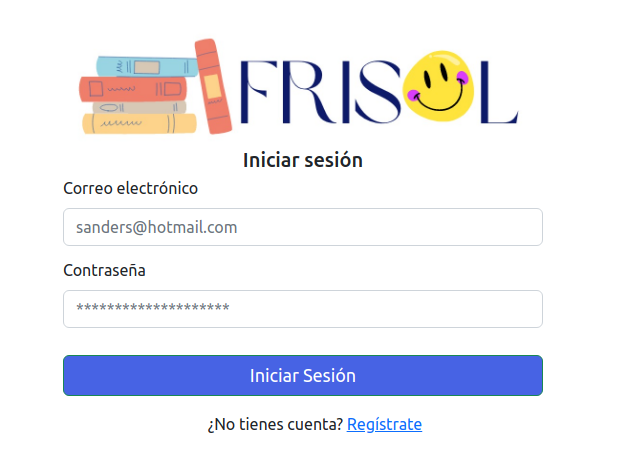
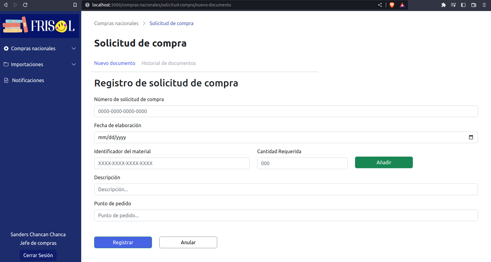
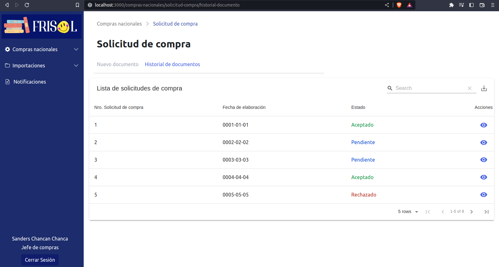
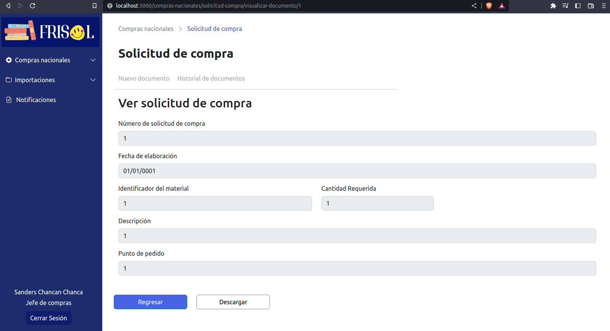
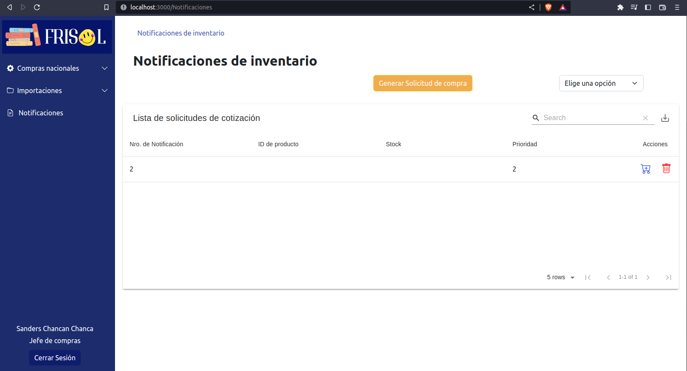

# :large_orange_diamond: DrimTim_Proyect

Project developed for the software engineering course (CC1143). Purchase module of an ERP, in which the client is a company that sells books and toys.

## :sparkles: Contributors

- Sanders Chancan Chanca
- Gomero Castillo, Brayan Eduardo
- Zapata Gallegos, Neo Marcelo
- Leandro Blas, Juan Jose

## :rocket: Getting Started

These instructions will get you a copy of the project up and running on your local machine for development and testing purposes.

### :computer: Prerequisites

The things you need before installing the software.

- Node js
- npm
- Access to your system terminal

### :cd: Installation

A step by step guide that will tell you how to get the development environment up and running.

```
$ cd frontend
$ npm install
$ npm start
$ cd ..
$ cd server
$ npm install
$ npm run dev
```

Done! now just wait for the browser to open the application.

## :pushpin: Screenshots

#### Login



#### Registro de documento: Solicitud de compra



#### Historial de documento: Solicitud de compra



#### Ver de documento: Solicitud de compra



#### Notificaciones de inventario


